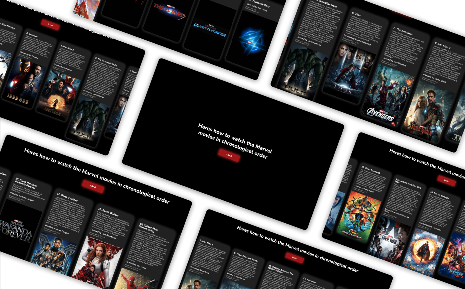

 
 
    
 <h1 align="center">Hi 👋, I'm Ryan</h1>
 <h3 align="center">A full stack web developer from London.</h3>
 
If you're interested in seeing some of my work, take a look at my GitHub profile. I've got a few client projects up here, as well as some personal projects that I work on in my spare time. I'm always open to collaboration, so if you see something you like, feel free to reach out! 

 

 
 
 

  
 

 

 

 
<h1 align="center">Projects</h1>
<table bordercolor="#66b2b2">
 
<tr>
<td width="50%" valign="top">
<h3 align="center">Marvel App</h3>
 

 

          
 

Built using HTML5, CSS3 JavaScript and a Marvel Api.  
An app for Marvel fans which shows the chronologic order in which the films are meant to be watched!

</td>
<td width="50%" valign="top">
<h3 align="center">HNL Electrical</h3>
 

 

          

</a>

Built using HTML5, CSS3, JavaScript and BootStrap. A website for a local electrician.

</td>
</tr>
 
 
